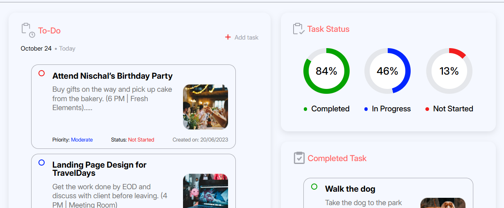

 

The site is a live demo of a responsive dashboard user interface, hosted as a project on GitHub Pages. It functions as a portfolio piece, showcasing various front-end development skills through a design featuring metric cards, multiple interactive charts, and a sidebar navigation. The current development is paused because the necessary design specifications and assets from the <a href="https://www.figma.com/design/oLX931SCGYc9hHxSUNruI4/To-do-List-Web-App-Design--Community-?node-id=16-34&p=f&t=BrgG2B9Abgzkgdto-0">Figma template</a> are incomplete.

<h3>React</h3>
